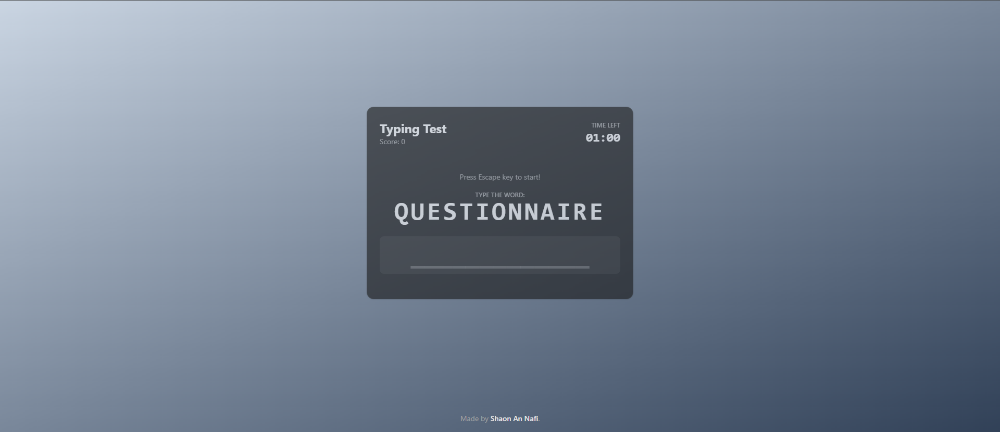

# ⌨️ Shadcn Typing Test

[](https://opensource.org/licenses/MIT)
[](https://react.dev/)
[](https://vitejs.dev/)
[](https://tailwindcss.com/)
[](https://ui.shadcn.com/)

Test and improve your typing speed and accuracy with this sleek, timed typing challenge built using React, Vite, Tailwind CSS, and Shadcn UI.



---

## ✨ Features

*   ⏱️ **Timed Challenge:** Race against the clock (60 seconds) to type as many words as accurately as possible.
*   🎯 **Real-time Feedback:** Instantly see correct/incorrect letters highlighted as you type.
*   💯 **Scoring System:** Earn points for correct words, lose points based on target word length for mistakes.
*   🔊 **Audio Cues:** Subtle sound effects enhance the experience (typing, backspace, score milestones).
*   🌓 **Dark Mode Default:** Sleek dark theme enabled out-of-the-box.
*   🚀 **Modern Stack:** Built with the latest tools for a fast and smooth experience.

## 🛠️ Tech Stack

*   **Framework:** [React](https://react.dev/)
*   **Build Tool:** [Vite](https://vitejs.dev/)
*   **Styling:** [Tailwind CSS](https://tailwindcss.com/)
*   **UI Components:** [Shadcn UI](https://ui.shadcn.com/)
*   **Audio:** [use-sound](https://github.com/joshwcomeau/use-sound)
*   **State Management:** React Context API

## 🚀 Getting Started

1.  **Clone the repository:**
    ```bash
    git clone https://github.com/your-username/your-repo-name.git
    cd your-repo-name
    ```
2.  **Install dependencies:**
    ```bash
    npm install
    # or
    yarn install
    # or
    pnpm install
    ```
3.  **Run the development server:**
    ```bash
    npm run dev
    # or
    yarn dev
    # or
    pnpm dev
    ```
4.  Open your browser to `http://localhost:5173` (or the port specified). Press any key to start!

## 📄 License

This project is licensed under the MIT License - see the [LICENSE](LICENSE) file for details (or simply state "MIT License").

---

*Made by [Shaon An Nafi](https://github.com/Nafisarkar)*